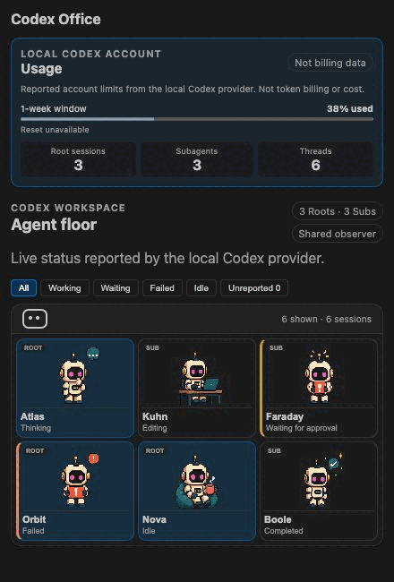

# Codex Office

> Watch local Codex agents work — privately, inside VS Code.

Codex Office is a local-first, read-only VS Code sidebar for visualizing Codex
sessions, nested subagents, and basic live status with animated pixel-art
characters.



## What it shows

- Workspace-scoped root sessions and reconstructed subagent hierarchy.
- Basic live states from the optional Shared observer: Working, Waiting,
  Failed, and Idle.
- Reported account-capacity windows and reset time when Codex provides them.
- Honest `Unreported` labels when current status is unavailable.

Account capacity is not token billing, cost, credits, or per-agent usage.
Codex Office does not claim per-agent token totals because the supported
content-free observer does not report them.

## Privacy and safety

- Runs locally and makes no telemetry or remote persistence calls.
- Never projects prompts, responses, commands, file contents, or workspace
  paths into the sidebar.
- Observes only; it cannot steer, stop, resume, or submit work to an agent.
- Uses strict, bounded provider schemas and fails closed when evidence is
  incomplete.

See [SECURITY.md](SECURITY.md) and the
[privacy requirements](docs/security/PRIVACY.md) for the full policy.

## Requirements and live status

- VS Code `^1.96.0` is declared. The Marketplace beta release record states
  which versions have actually been tested.
- Persisted workspace inventory works without experimental configuration.
- Basic live status is currently pinned to Codex CLI `0.145.0` and requires
  its owner-only managed App Server daemon.

To opt in, enable **Codex Office › Experimental Shared App Server** in VS Code
settings, ensure the supported local Codex daemon is already running, then
reload VS Code. The extension never starts, stops, or configures that daemon.
If the shared observer is unavailable, the room safely falls back to persisted
inventory and labels status as `Unreported`.

This integration is experimental and disabled by default because the upstream
local transport may change.

## Product principles

- Codex-first and local-first.
- Read-only observer before control features.
- Report telemetry honestly; never present estimates as billing facts.
- Accessible even when animation is disabled.
- Provider/domain/UI boundaries must stay independently testable.

## Quick start

### Install from the Marketplace

Install [Codex Office](https://marketplace.visualstudio.com/items?itemName=dejth.codex-office)
from the Visual Studio Marketplace, then open **Codex Office** from the
Activity Bar.

### Install a reviewed VSIX

In VS Code, choose **Extensions: Install from VSIX…**, select the reviewed
release artifact, and open **Codex Office** from the Activity Bar.

### Develop locally

```bash
corepack enable
pnpm install
pnpm check
pnpm dev
```

Keep `pnpm dev` running, then press `F5` in VS Code and choose
**Run Codex Office Extension** if prompted. The checked-in launch configuration
loads the current workspace build in an Extension Development Host regardless
of the active editor. Open **Codex Office** in the Activity Bar. The development
host starts without a workspace; use **File → Open Folder…** there when testing
workspace-scoped discovery. The debug profile disables unrelated installed
extensions so their output does not pollute the shared Debug Console.

## Documentation map

- [Vision](docs/product/VISION.md)
- [CDD index](docs/cdd/README.md)
- [Architecture](docs/engineering/ARCHITECTURE.md)
- [UI/UX specification](docs/design/UI_UX_SPEC.md)
- [Roadmap](docs/product/ROADMAP.md)
- [Development workflow](docs/engineering/DEVELOPMENT_WORKFLOW.md)
- [Marketplace publishing](docs/release/MARKETPLACE.md)
- [Agent operating model](docs/agents/MULTI_AGENT_PLAYBOOK.md)

## Current limitations

- Live status is basic lifecycle state, not tool-level activity.
- Sessions not loaded in the shared daemon remain `Unreported`.
- Per-agent token usage is intentionally unavailable.

## Contributing

Read [CONTRIBUTING.md](CONTRIBUTING.md), [AGENTS.md](AGENTS.md), and the nearest nested `AGENTS.md` before making changes.

## License

MIT — see [LICENSE](LICENSE).
